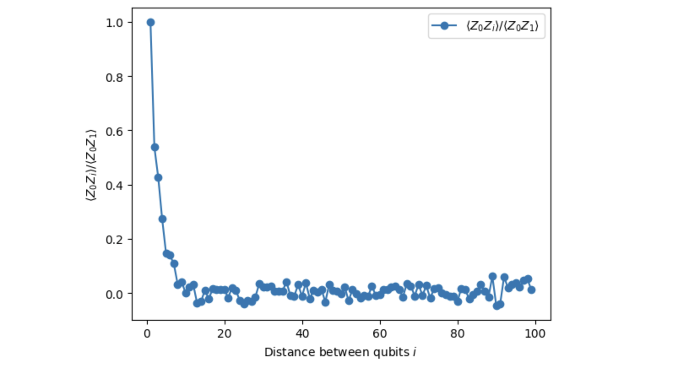

# Quantum Circuit Hello World & GHZ State Example

This repository demonstrates how to construct, optimize, and execute quantum circuits using Qiskit and IBM Quantum backends. It includes step-by-step Jupyter notebooks for both a simple 2-qubit Bell state and an extended $n$-qubit GHZ state, with post-processing and visualization of results.

<p align="center">
  
</p>

## Contents

- `hello-world.ipynb`: Main notebook with code and explanations for Bell and GHZ state experiments.
- `installation.ipynb`: Instructions and code for installing required dependencies.
- `INSTRUCTIONS.md`: Additional usage or setup instructions.

## Requirements

- Python 3.8+
- Jupyter Notebook or VS Code with Jupyter extension
- Qiskit
- IBM Quantum account (for real backend execution)

## Quick Start

1. Clone this repository:
   ```sh
   git clone https://github.com/oliviafjardine/hello-world-qiskit.git
   cd cwq
   ```
2. Install dependencies (see `installation.ipynb` for details):
   ```sh
   pip install qiskit qiskit-aer matplotlib
   ```
3. (Optional) Set up IBM Quantum account:
   ```python
   from qiskit_ibm_runtime import QiskitRuntimeService
   QiskitRuntimeService.save_account('<YOUR_IBM_QUANTUM_TOKEN>')
   ```
4. Open `hello-world.ipynb` in Jupyter or VS Code and follow the steps.

## Features

- Bell state circuit construction and measurement
- $n$-qubit GHZ state circuit generation
- Operator construction and expectation value calculation
- Backend transpilation and execution (simulator and real device)
- Result post-processing and plotting

## References
- [Qiskit Documentation](https://qiskit.org/documentation/)
- [IBM Quantum](https://quantum-computing.ibm.com/)

## License

MIT License
